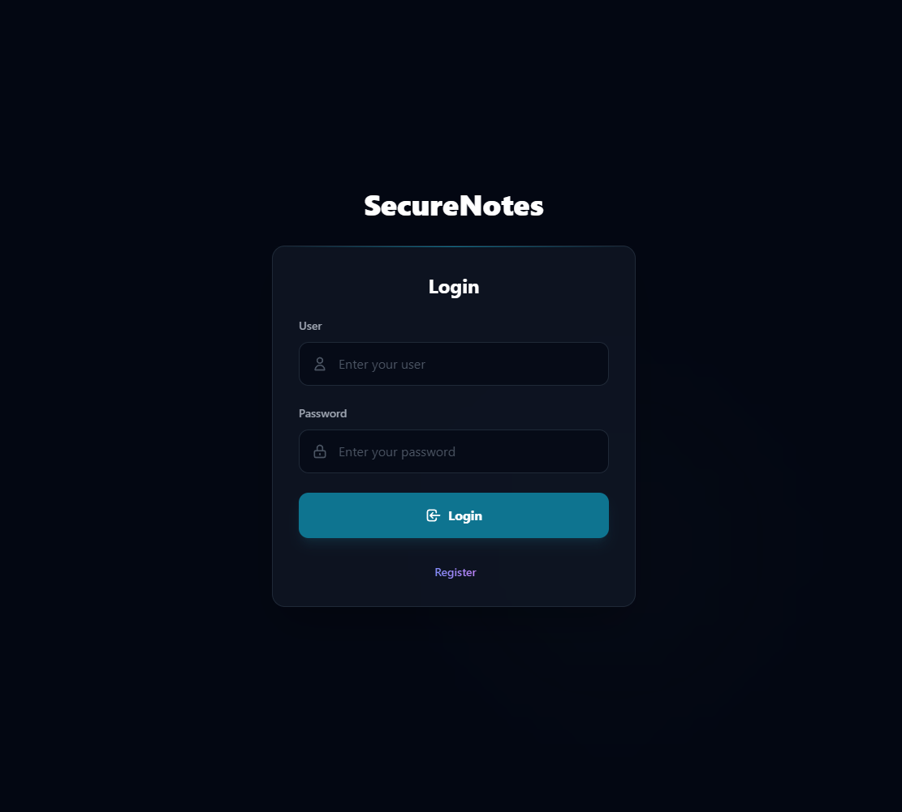
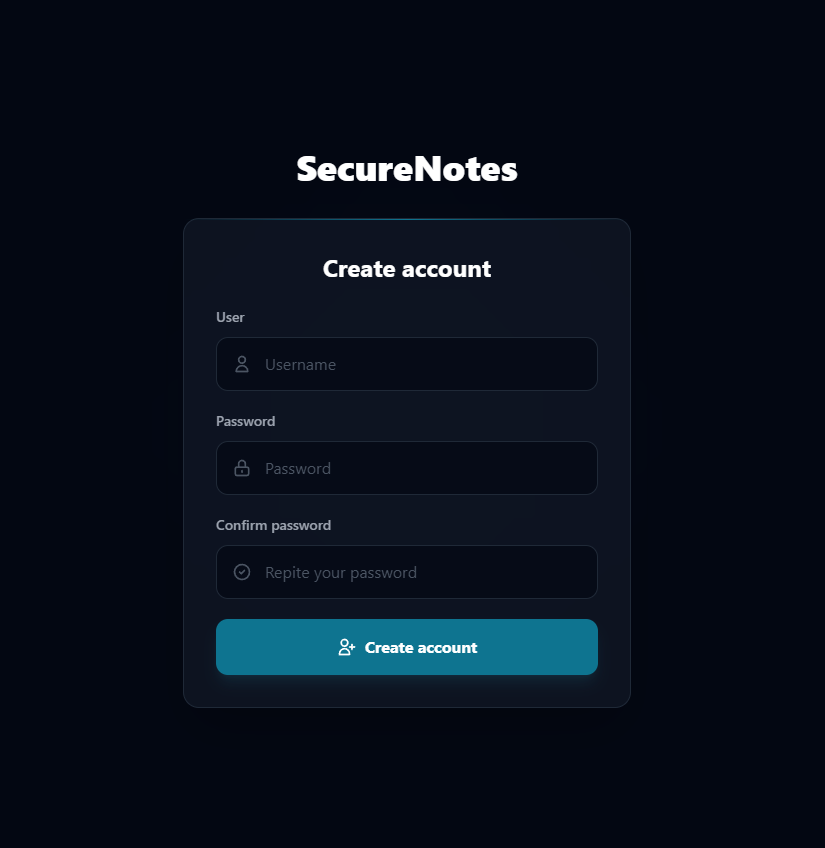
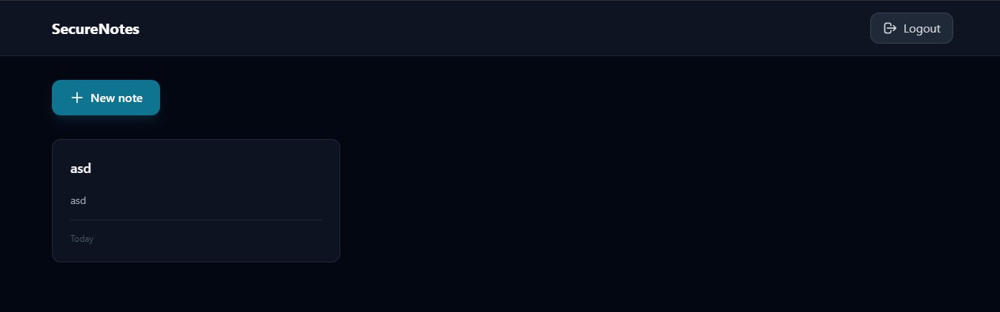
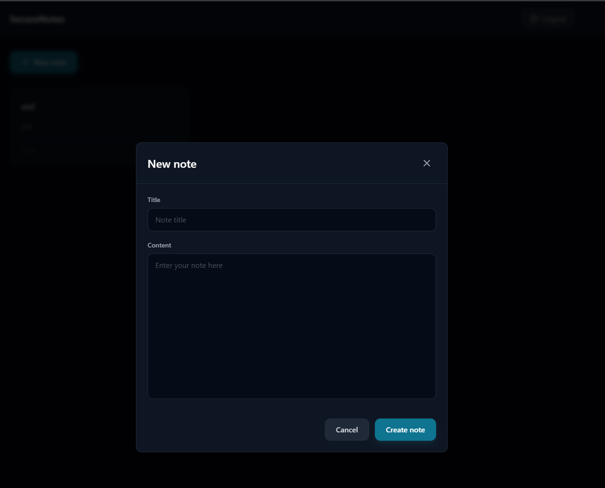

# SecureNotes

A secure personal notes application with end-to-end encryption (E2EE), AES-256 encryption for all notes and user data. Designed as a practice project and deployed on Proxmox as a self host solution with a modern dark theme interface.

All notes are encrypted client-side before being sent to the server, ensuring complete privacy without relying on external services.

## Screenshots

<p align="center">
  
  
  
  
</p>

## Prerequisites

- Node.js 20+
- PostgreSQL 12+

## Installation

### 1. Database Setup

Create a PostgreSQL database and execute the schema:

```bash
psql -U postgres -d postgres -f database/schema.sql
```

Or manually create the database and run the SQL script from `database/schema.sql`.

### 2. Install Dependencies

Install dependencies for both backend and frontend:

```bash
cd backend && npm install
cd ../frontend && npm install
```

### 3. Environment Configuration

Create a `.env` file in the `backend` folder with the following variables:

- `DB_USER`: PostgreSQL username
- `DB_HOST`: Database host (example: localhost)
- `DB_NAME`: Database name (example: securenotes)
- `DB_PASSWORD`: PostgreSQL password
- `DB_PORT`: PostgreSQL port (default: 5432)
- `JWT_SECRET`: JWT token
- `PORT`: Backend server port (default: 4000)

### 4. Run the Application

Start the backend server:

```bash
cd backend
npm run dev
```

Start the frontend development server:

```bash
cd frontend
npm run dev
```

The application will be available at `http://localhost:5173` by default

## License

MIT
